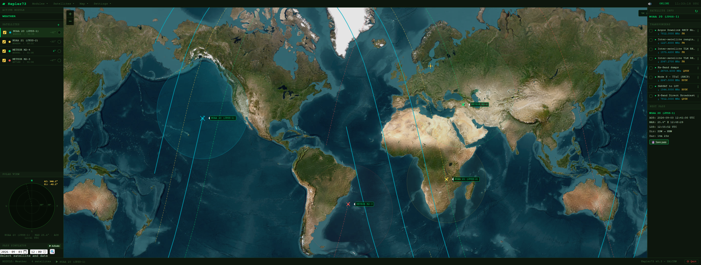
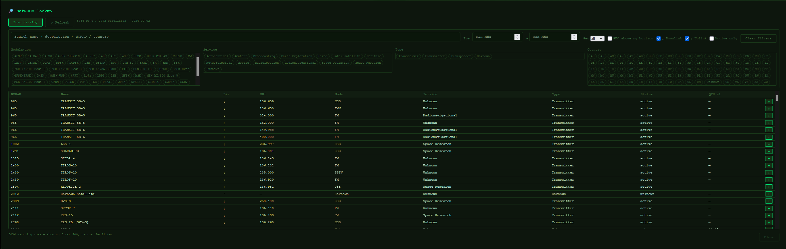
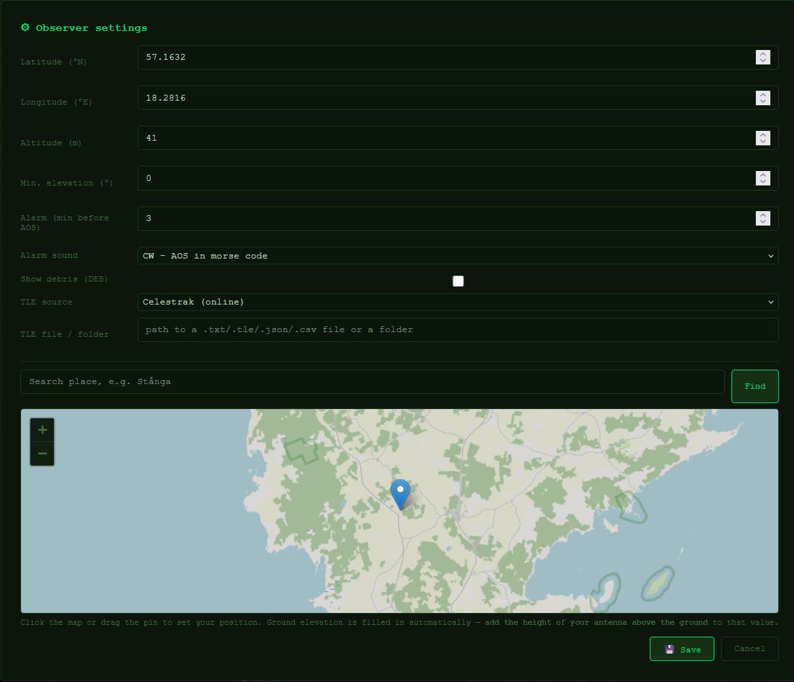

# 🛰 Kepler73

**A real-time satellite tracking application for amateur radio operators.**

Built by SA1CKW with help of AI — designed for practical use at the radio shack.

---

## Overview

Kepler73 is a web-based satellite tracker that runs locally on your machine. It uses SGP4 orbital mechanics to compute real-time satellite positions, predict upcoming passes, and assist with amateur radio satellite operations — including Doppler correction and pass alarms.

The interface runs in your browser, but everything is computed locally. No cloud, no account, no ads.


---

## Features

### 🗺 Live Map
- Real-time satellite positions on an interactive world map (OpenStreetMap / Esri Satellite)
- Ground tracks for all active satellites; extended 3-orbit track for the selected one
- Footprint circle showing coverage area
- Observer marker at your configured location
- **Lock map** checkbox per satellite — keep one satellite centred while the map pans under it
- Decayed / re-entered objects are greyed out and struck through, and get no marker

### 📡 Satellite Modules
- Organize satellites into named modules (e.g. LEO, Weather, AMSAT)
- Add satellites by name or NORAD ID from Celestrak, from the SatNOGS lookup, or by
  loading / pasting a local element file
- **Export TLEs** (this module or all modules) as a `.txt` file so Gpredict's
  *Update TLE from local files* uses the exact same elements

### 🔎 SatNOGS Lookup
- Browse the whole SatNOGS catalogue with faceted filters: text, frequency range,
  geostationary (all / only / hide), "GEO above my horizon" (from your QTH),
  downlink/uplink, active-only
- Chip groups for modulation / service / type / country that grey out values with zero matches
- One click adds a satellite to the active module

### 🧭 Polar View
- Real-time azimuth/elevation strobe pointing toward the selected satellite
- Dot appears when the satellite rises above the horizon
- Live AZ / EL readout and N/E/S/W compass rose

### ⏱ Pass Prediction & Simulator
- Next-pass AOS/LOS, max elevation, azimuths, compass directions, duration, peak Doppler
- Save a pass to a text log (times, az/el track, transponder frequencies)
- **Pass simulator**: pick any date up to a year back / a month forward and scrub through
  that pass on a slider. With a folder of dated TLE files it automatically uses the element
  set closest in time to the simulated date, so historical passes are accurate.

### 🔔 Pass Alarm
- Configurable audio alarm before AOS (default: 3 minutes)
- Alarm sounds: CW "AOS" in Morse, three beeps, rising radar tone, long beep
- Per-satellite alarm toggle; alarm re-arms for each new pass
- Mutes itself if the browser tab has been closed

### 📻 Transponder & Doppler
- Transponder data from the SatNOGS database (uplink/downlink, mode, status)
- Live Doppler shift per transponder (Hz and kHz Δ), updated every second
- Before a pass: maximum expected Doppler shift

### 🌍 Offline & TLE sources
- TLE source selectable: **Celestrak (online)**, **Local file (offline)**, or
  **Local file, then Celestrak**. The local source reads one file or a whole folder of
  `.txt` / `.tle` / `.json` / `.csv` (classic TLE / 3LE with Alpha-5, Celestrak GP JSON, GP CSV).
- Works offline using cached TLE and map-tile data.
- Gentle on Celestrak: auto-update only re-fetches element sets older than ~18 h, and the
  manual "Update all TLEs" is limited to once per 2 h (with a confirm) because Celestrak
  temporarily blocks IPs that poll too hard. If Celestrak has blocked you, Kepler73 falls
  back to the cached SatNOGS catalogue and shows a status-bar notice.

### ⚙️ Settings
- Observer location by lat/lon/alt **or** a mini-map: search a place name, drag the pin,
  altitude fills in automatically (Open-Meteo)
- Minimum elevation for pass prediction
- Alarm timing and sound
- TLE source and file/folder path

---

## Screenshots

**Main view** — live map, satellite list, polar view, and the transponder / next-pass panel.



**SatNOGS lookup** — faceted filtering (modulation / service / type / country / frequency /
geostationary) over the whole SatNOGS catalogue; the ＋ button adds a satellite to the
active module.



**Observer settings** — set your location by dragging the pin or searching a place name;
ground elevation is filled in automatically.



---

## Installation (Windows)

A pre-built Windows executable is available under [Releases](../../releases).

1. Download and unzip `Kepler73-Win.zip`
2. Double-click `Kepler73.exe`
3. Your browser opens automatically at `http://127.0.0.1:5000`

No Python or any other software required.

## Run from source

Any OS with Python **3.11+**:

```bash
git clone https://github.com/Melkutt/Kepler73-Satellite_tracker.git
cd Kepler73-Satellite_tracker
pip install -r requirements.txt
python main.py
```

The server starts on <http://127.0.0.1:5000> and opens your browser after ~1.5 s.
There is no build step for the frontend (plain HTML/CSS/vanilla JS).

---

## Notes

- **Single-user, localhost only.** It runs the Werkzeug development server — do not expose
  it to a network.
- Your observer location, modules and all caches live under `data/`, which is git-ignored
  and never leaves your machine.
- Pass accuracy is only as good as the element set — a day-old LEO TLE is within ~1 s on
  pass times; anything weeks old drifts noticeably.

## Roadmap

- [x] Live satellite tracking
- [x] Pass prediction and simulator
- [x] Pass alarms
- [x] Polar view with real-time strobe
- [x] SatNOGS transponder data and lookup
- [x] Real-time Doppler correction
- [x] Offline / local-file TLE sources
- [ ] CAT radio control (Hamlib)
- [ ] Rotor control (Hamlib `rotctld`)
- [ ] Bulk Celestrak `GROUP` fetches
- [ ] macOS and Linux builds

---

## License

Personal/amateur use. TLE data courtesy of [Celestrak](https://celestrak.org). Transponder data courtesy of [SatNOGS](https://db.satnogs.org). Orbital mechanics via [python-sgp4](https://github.com/brandon-rhodes/python-sgp4).

---

*73 de SA1CKW*
